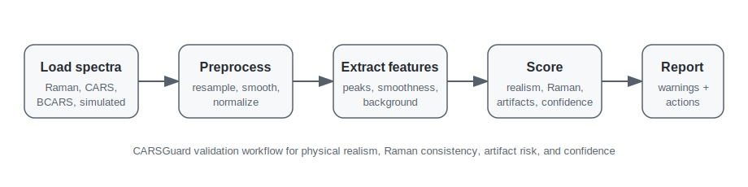

# CARSGuard


**CARSGuard** is a validation and quality-control framework for assessing the physical realism, Raman consistency, artifact risk, and confidence of CARS/BCARS spectra.

It works with simulated, recovered, or uploaded coherent Raman spectra and produces interpretable scores, warnings, reference comparisons, and actionable recommendations.

---

## Why this project matters

CARS/BCARS spectra can look visually plausible while still containing unrealistic artifacts, unstable retrieval behavior, poor Raman consistency, or suspicious background dominance. A reconstruction that looks right is not necessarily physically valid.

CARSGuard provides a transparent validation layer for checking whether spectra are:

- experimentally plausible
- chemically consistent with Raman-like references
- free from obvious artifacts
- suitable for downstream benchmarking
- reliable enough to inspect, compare, or report

Rather than a single opaque quality number, it reports several interpretable scores, each with its own warnings and recommendations, so that a result can be inspected and argued with.

The goal is not to replace expert judgment, but to support reproducible and interpretable quality control for spectroscopy workflows.

---

## Project status

CARSGuard is **alpha-stage research software**.

| Component | Status |
|---|---|
| CARS/BCARS spectrum loading | Implemented |
| Raman spectrum loading | Implemented |
| CARSBench adapter | Implemented |
| Preprocessing and harmonization | Implemented |
| Spectral feature extraction | Implemented |
| Reference profile construction | Implemented |
| BCARS/CARS realism scoring | Implemented |
| Raman consistency scoring | Implemented |
| Artifact-risk scoring | Implemented |
| Confidence scoring | Implemented |
| JSON/text report export | Implemented |
| Unit tests | Implemented |
| GitHub Actions CI | Implemented |
| Ruff linting in CI | Implemented |
| Markdown link checker | Implemented |
| Citation metadata | Implemented |
| Changelog | Implemented |
| Lightweight documentation | Implemented |
| Example validation report | Implemented |
| Workflow diagram | Implemented |
| Streamlit/app interface | Prototype |
| Class-conditional reference profiles | Planned |
| Uncertainty calibration | Planned |
| Real-data validation report | Planned |
| Full documentation site | Planned |

---

## Key features

- Load real Raman, real CARS/BCARS, and simulated spectra
- Build benchmark tables from multiple spectrum sources
- Preprocess and harmonize spectra onto a common axis
- Extract interpretable spectral features
- Build reference profiles from real or curated spectra
- Score spectra across four validation dimensions
- Generate warnings and recommendations
- Export validation reports in JSON and text form
- Integrate directly with CARSBench-generated spectra

---

## Validation scores

CARSGuard uses multiple interpretable scores instead of a single opaque quality score.

| Score | Purpose |
|---|---|
| BCARS/CARS realism | How experimentally plausible a CARS/BCARS spectrum is relative to coherent Raman references |
| Raman consistency | How well a recovered or Raman-like spectrum agrees with Raman reference behavior |
| Artifact risk | Detects spikes, oscillations, unrealistic narrow peaks, or excessive background dominance |
| Confidence | Summarizes how reliable the validation result is, given support from the scoring modules |

---

## Workflow

```text
Load spectra
Build benchmark table
Preprocess and harmonize spectra
Extract spectral features
Build reference profiles
Score spectra
Generate reports
Inspect warnings and recommendations
```



---

## Installation

```bash
git clone https://github.com/rhouhou/CARSGuard.git
cd CARSGuard
```

Create and activate a virtual environment:

```bash
python -m venv .venv

# macOS / Linux
source .venv/bin/activate

# Windows
.venv\Scripts\activate
```

Install the package in editable mode:

```bash
python -m pip install --upgrade pip setuptools wheel
python -m pip install -e .
python -m pip install pytest
```

On systems where the interpreter is `python3`, substitute `python3` throughout.

### Installation check

```bash
python -c "import carsguard; print(carsguard.__name__)"
python -m pytest
```

Expected output from the first command:

```text
carsguard
```

---

## Basic workflow

### 1. Build the benchmark table

```bash
python scripts/build_benchmark_table.py
```

### 2. Preprocess spectra

```bash
python scripts/preprocess_dataset.py \
  --x-min 800 \
  --x-max 1800 \
  --num-points 1000 \
  --normalization max
```

### 3. Extract features

```bash
python scripts/extract_features.py
```

### 4. Build reference profiles

```bash
python scripts/build_reference_profiles.py \
  --raman-source-type ramanbiolib \
  --cars-source-type real_cars
```

### 5. Score a single spectrum

```bash
python scripts/score_single_spectrum.py \
  data/raw/carsbench/example.csv \
  --domain BCARS \
  --raman-reference outputs/references/raman_reference.json \
  --cars-reference outputs/references/cars_reference.json
```

### 6. Score all spectra

```bash
python scripts/score_dataset.py \
  --raman-reference outputs/references/raman_reference.json \
  --cars-reference outputs/references/cars_reference.json
```

---

## Example report

A validation report contains realism, Raman-consistency, artifact-risk, and confidence
scores, together with warnings, recommendations, and nearest reference matches.

```json
{
  "spectrum_id": "sim_001",
  "bcars_realism": { "score": 0.73 },
  "raman_consistency": { "score": 0.61 },
  "artifact_risk": { "score": 0.22 },
  "confidence": { "score": 0.68 },
  "warnings": [
    "background may dominate resonant structure"
  ],
  "recommendations": [
    "Inspect the non-resonant background level; it may be outside the experimentally plausible range."
  ]
}
```

A complete example is in [`examples/example_validation_report.json`](examples/example_validation_report.json).

---

## Data layout

CARSGuard expects raw and generated data under `data/`:

```text
data/
  raw/
    ramanbiolib/
    real_cars/
    carsbench/
    external/

  benchmark_table.csv
```

The benchmark table stores per-spectrum metadata: spectrum ID, source type, domain, file
path, preprocessing status, and optional pairing or reference information. Large raw
datasets should not usually be committed to Git.

---

## Configuration

```text
configs/
  default.yaml
  preprocessing.yaml
  references.yaml
  scoring.yaml
```

These define default paths, preprocessing parameters, reference-profile settings, and
scoring behavior.

---

## Repository structure

```text
CARSGuard/
  app/            Prototype app / interface components
  configs/        Default validation, preprocessing, reference, scoring settings
  data/           Data documentation and benchmark metadata
  docs/           Documentation and design notes
  notebooks/      Exploratory notebooks
  scripts/        Command-line workflows
  src/carsguard/
    core/         Core data models and validation objects
    io/           Spectrum loading and data input
    preprocessing/  Resampling, smoothing, normalization, harmonization
    features/     Spectral feature extraction
    references/   Reference profiles and nearest-reference logic
    scoring/      Realism, Raman consistency, artifact-risk, confidence
    reports/      JSON/text report generation
    integration/  CARSBench and external workflow adapters
    utils/        Shared utilities
  tests/          Unit tests
```

---

## Documentation

- [`docs/index.md`](docs/index.md)
- [`docs/scoring.md`](docs/scoring.md)
- [`docs/preprocessing.md`](docs/preprocessing.md)
- [`docs/references.md`](docs/references.md)
- [`docs/reports.md`](docs/reports.md)
- [`docs/integration.md`](docs/integration.md)
- [`data/README.md`](data/README.md)
- [`examples/README.md`](examples/README.md)
- [`scripts/README.md`](scripts/README.md)
- [`app/README.md`](app/README.md)

---

## The CARS/BCARS ecosystem

CARSGuard is the validation layer of a three-part workflow:

```text
CARSBench  → simulate benchmark spectra under controlled domain shifts
prCARS     → retrieve Raman-like spectra
CARSGuard  → validate plausibility, consistency, and artifact risk
```

| Project | Role |
|---|---|
| [CARSBench](https://github.com/rhouhou/CARSBench) | Simulates CARS/BCARS spectra under controlled domain shifts |
| [prCARS](https://github.com/rhouhou/prCARS) | Retrieves Raman-like signals from CARS/BCARS spectra |
| CARSGuard | Validates spectra and retrieval outputs |

---

## Design philosophy

CARSGuard is intentionally modular, interpretable, dataset-aware, conservative in its
claims, and easy to extend with new references and scoring rules. It is meant to flag
suspicious spectra and guide inspection, not to make final scientific or clinical
decisions automatically.

---

## Limitations

CARSGuard is alpha-stage validation software. Current limitations:

- scoring rules are partly heuristic
- reference profiles are simple and should be expanded
- no uncertainty calibration yet
- no class-conditional reference modeling yet
- no full real-data validation report yet
- app/interface components are prototype-stage

This project is **not intended for clinical diagnosis, medical decision-making, or
deployment in real healthcare settings**.

---

## Roadmap

- Class-specific reference profiles
- Richer artifact taxonomy
- Uncertainty and confidence calibration
- Integration examples with CARSBench and prCARS
- Streamlit upload interface
- PDF/HTML report export
- Real-data validation examples where licensing allows
- Full documentation site

---

## Changelog

See [`CHANGELOG.md`](CHANGELOG.md).

---

## Citation

If you use CARSGuard in research, education, or benchmarking work, please cite it using
the metadata in [`CITATION.cff`](CITATION.cff).

```bibtex
@misc{carsguard2026,
  title={CARSGuard: Validation Framework for Physical Realism and Raman Consistency in CARS/BCARS Spectra},
  author={Houhou, Rola},
  year={2026},
  note={Alpha research software},
  url={https://github.com/rhouhou/CARSGuard}
}
```

---

## License

MIT. See [`LICENSE`](LICENSE).

---

*Part of my research on biophotonics and machine learning — [biophotonics-ai.de](https://biophotonics-ai.de)*